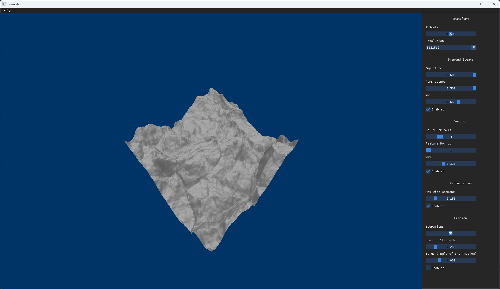
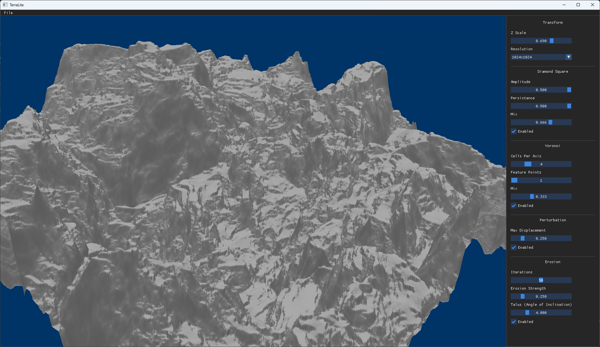

***

**TerraLite** is a terrain generation tool that gives users full agency and control over it's various procedural functions. Written in C++ and OpenGL, TerraLite can generate complex, high-resolution heightmaps in real-time -- all on the CPU.

# References

The terrain generation methods/algorithms in this projects source are based on the ideas presented in:

* "Realtime Procedural Terrain Generation: Realtime Synthesis of Eroded Fractal Terrain for Use in Computer Games" by Jacob Olsen, 2004.   [Link](https://web.mit.edu/cesium/Public/terrain.pdf)

# Features

* Noise Generation
    * Diamond Square (1/f noise)
    * Voronoi diagrams (for feature points)
    * Perlin Noise
* Erosion simulation
    * Combination of hydraulic and thermal erosion techniques
    * Iterative solver that displaces material from high areas to low areas
    * Samples Von Neumman neighborhoods for efficency
* I/O
    * Export heightmap as .png
 
# Preview
&nbsp;&nbsp;

# Build

Project files and build are generated using CMake. I reccommend creating a folder called build and running 
```
cmake ..
```
from that directory. This will generate relevant project files which you can then use to build and run.
